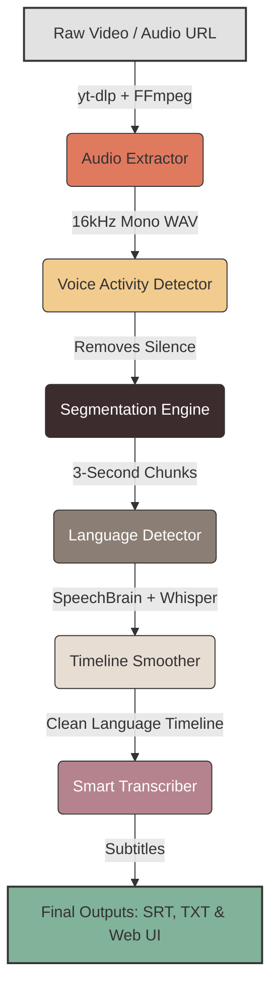

<div align="center">
  
# 🎙️ FrameSpeech
**AI Audio Intelligence Pipeline for Code-Switched Transcription**

[](https://www.python.org/downloads/)
[](https://fastapi.tiangolo.com)
[](https://pytorch.org/)
[](https://opensource.org/licenses/MIT)

*An advanced AI-powered pipeline capable of analyzing videos and audio files to automatically detect and transcribe multiple languages seamlessly.*

</div>

---

## 📌 The Problem

When speakers mix multiple languages (e.g., speaking English and Hindi in the same sentence), standard AI models get confused. They try to force everything into one language, resulting in severe "hallucinations" or completely broken transcriptions. 

**FrameSpeech** solves this by actively monitoring the language *second-by-second*, ensuring accurate, code-switched subtitles.

## 🚀 Features

- **📺 Direct YouTube Extraction:** Paste any YouTube URL and the system automatically rips, downmixes, and standardizes the audio track.
- **🔇 Smart Silence Filtering:** Uses Silero VAD to detect exact timestamps of human speech, throwing away background music and silence to save GPU memory.
- **🧠 Granular Language Detection:** Chops speech into 3-second overlapping windows and analyzes them using SpeechBrain (ECAPA-TDNN).
- **⏱️ Timeline Smoothing:** Applies a non-linear median filter to fix AI hallucinations and create a cohesive language timeline.
- **✍️ Guided Smart Transcription:** Feeds the exact language timeline into OpenAI's Whisper model to enforce the correct alphabet and language during transcription.
- **✨ Beautiful Web Interface:** A completely asynchronous Vanilla JS + HTML/CSS frontend with Server-Sent Events (SSE) for live job tracking.

## 🏗️ Architecture



## 🛠️ Setup & Installation

**Prerequisites:**
- Windows/Linux with Python 3.11+
- FFmpeg installed and in your system PATH
- An NVIDIA GPU (4GB+ VRAM recommended) for CUDA acceleration

**1. Clone the repository**
```bash
git clone https://github.com/Duljit2006/frame-speech.git
cd frame-speech
```

**2. Set up the virtual environment**
```bash
cd lid-pipeline
python -m venv venv
venv\Scripts\activate
```

**3. Install dependencies**
```bash
pip install -r requirements.txt
```

**4. Run the Application**
If you are on Windows, simply double-click the `start_server.bat` file in the root directory!
Alternatively, run:
```bash
python -m uvicorn backend.main:app --host 0.0.0.0 --port 8000
```

## 📸 Interface

The frontend provides an intuitive Workspace environment. You can paste URLs, upload local files, choose your Whisper model size (Tiny through Large-v3), and track processing progress live.

## 🤝 Contributing
Contributions, issues, and feature requests are welcome! Feel free to check the [issues page](https://github.com/Duljit2006/frame-speech/issues).

## 📝 License
This project is [MIT](https://opensource.org/licenses/MIT) licensed.
