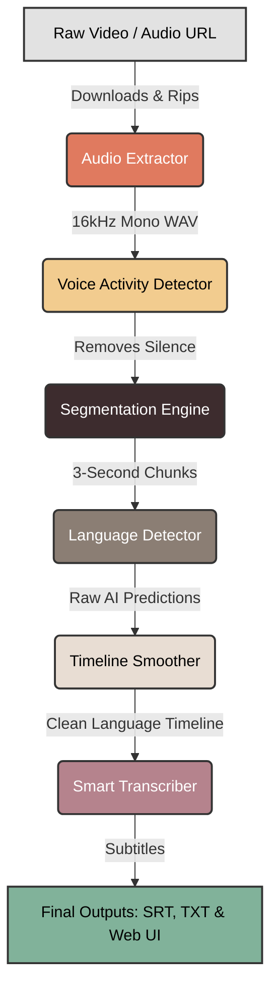

# FrameSpeech: AI Audio Intelligence
**Internship Progress Report**

---

## 📌 Project Overview
**FrameSpeech** is an advanced AI-powered web application capable of analyzing videos and audio files to automatically detect and transcribe multiple languages seamlessly. 

The system solves a major problem with modern AI transcription: when speakers mix multiple languages (like speaking English and Hindi in the same sentence), standard AI models get confused and try to force everything into one language. FrameSpeech actively monitors the language *second-by-second* to ensure accurate, multi-language subtitles.

---

## 🏗️ System Architecture & Workflow
Based on architectural mapping, the system is designed as a **pipeline**. When a user uploads a video or pastes a YouTube link, the audio travels through six distinct AI blocks. 

Here is what happens to the audio in each block:

### 1. Audio Extractor (The Ripper)
* **What it does:** It prepares the raw media.
* **How it works:** Whether a local video file is uploaded or a YouTube URL is provided, this block rips the audio track out of the video. It then cleans the audio by forcing it into a standard format so that the AI models down the line do not get confused. 
* **Technical Details:** Uses `yt-dlp` for URL resolution and downloading. Utilizes `ffmpeg-python` bindings (`FFmpegExtractAudio` post-processor) to downmix the audio channels to mono (`ac=1`) and resample the frequency to 16kHz (`ar=16000`), exporting as a PCM 16-bit WAV file (`acodec=pcm_s16le`).

### 2. Voice Activity Detector (The Silence Filter)
* **What it does:** It finds where people are actually talking.
* **How it works:** Instead of forcing heavy AI models to listen to 10 minutes of background music or silence, this block uses a lightweight AI model to scan the audio and highlight exact timestamps where human speech is occurring. It discards the silence, saving massive amounts of processing time and computer memory.
* **Technical Details:** Initializes the `snakers4/silero-vad` model via PyTorch Hub. The audio is loaded as a float32 tensor using `soundfile`. The `get_speech_timestamps` function is executed with a defined confidence threshold to yield sample indices containing speech, which are then converted to precise millisecond intervals.

### 3. Segmentation Engine (The Chopper)
* **What it does:** It slices the speech into bite-sized pieces.
* **How it works:** AI language detectors are generally poor at listening to a 5-minute speech and guessing the language accurately. Instead, this block chops the continuous human speech into small, overlapping 3-second windows. 
* **Technical Details:** Applies a sliding window algorithm over the extracted speech intervals. It generates overlapping windows (e.g., 3.0s window size, 1.0s stride). Overlap is critical to ensure boundary words are not cut off, providing sufficient contextual acoustic data for the subsequent classification models.

### 4. Language Detector (The Classifier)
* **What it does:** It guesses the language of each 3-second slice.
* **How it works:** This is the core intelligence of the language detector. It passes each 3-second slice of audio to a heavy AI model called **SpeechBrain** (which was trained on thousands of hours of YouTube videos across 107 languages). The model listens to the slice and scores it (e.g., "92% confidence this is Hindi"). If SpeechBrain is unsure, it uses a fallback model to double-check.
* **Technical Details:** Iterates through the sliding windows and extracts numpy slices. Uses `speechbrain/lang-id-voxlingua107-ecapa` (an ECAPA-TDNN architecture) via PyTorch on `cuda` or `cpu`. The log-softmax posteriors are exponentiated to yield real probabilities. If the top-1 confidence falls below the strict threshold (e.g., 0.85), a fallback mechanism triggers OpenAI's Whisper model (using `detect_language` on the log-mel spectrogram) to cross-verify the chunk.

### 5. Timeline Smoother (The Refiner)
* **What it does:** It fixes AI hallucinations and glitches.
* **How it works:** Because the audio was chopped into tiny 3-second slices, the AI might occasionally make a random mistake (like predicting Spanish for 1 second in the middle of an English sentence). This block acts like an editor. It looks at the timeline and smooths it out, removing impossible split-second glitches and creating clean, logical language blocks.
* **Technical Details:** Consolidates the raw frame-level predictions by applying a non-linear median filter (time-bin voting algorithm). This removes high-frequency noise and spurious language switches. It ultimately merges contiguous overlapping windows of the same language class into cohesive, macroscopic language blocks (yielding `start`, `end`, and `language`).

### 6. Smart Transcriber (The Scribe)
* **What it does:** It writes the final subtitles.
* **How it works:** With a perfect, smoothed timeline of exactly which languages were spoken and when, the audio is passed to OpenAI's **Whisper** model. However, instead of letting Whisper guess blindly, it is provided with the exact language layout based on the timeline. This forces Whisper to write English words in the English alphabet, and Hindi words in the Hindi alphabet, creating a perfect code-switched transcript.
* **Technical Details:** Initializes `openai/whisper` (e.g., `large-v3` or `small`). For each smoothed language block, the corresponding audio slice is cropped. Whisper's `transcribe` method is invoked with the `language` argument explicitly overridden (Language Hinting) based on the LID pipeline's output. This suppresses Whisper's default auto-detect behavior and enforces target-language token generation (preventing unwanted transliterations). The results are serialized into standard SRT and TXT formats.

---

## 🚀 Current Status & Achievements
- **Backend Stability:** The task manager was upgraded with threading concurrency locks to ensure the server does not crash from memory overload (GPU OOM) when multiple transcription tasks are submitted simultaneously.
- **Auto-Cleanup:** An automated asynchronous garbage collector was engineered in FastAPI to delete temporary audio files and jobs after 120 minutes, preventing hard drive storage bloat.
- **Web Interface:** A dynamic, asynchronous web application was built using vanilla JS and HTML/CSS, featuring drag-and-drop file uploads, visual language charts, Server-Sent Events (SSE) for job streaming, and downloadable SRT/TXT files.
- **Live Deployment:** The application was successfully deployed to a live public URL using `ngrok`, allowing external testing and demonstrations.
