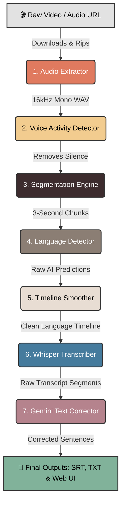
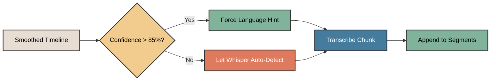
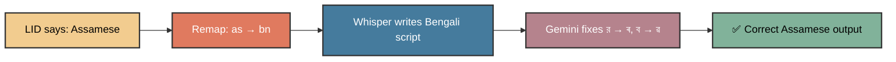
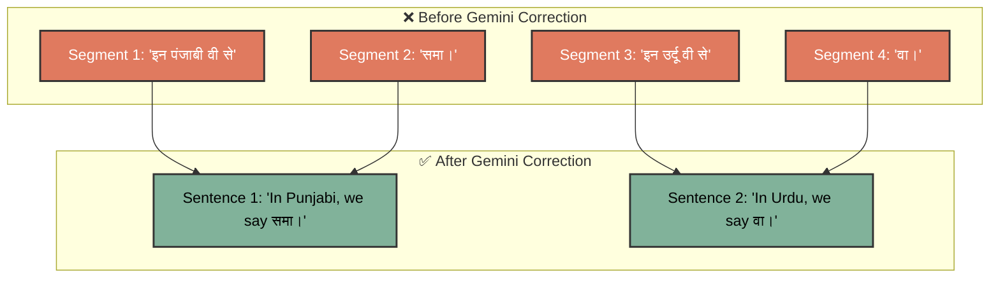
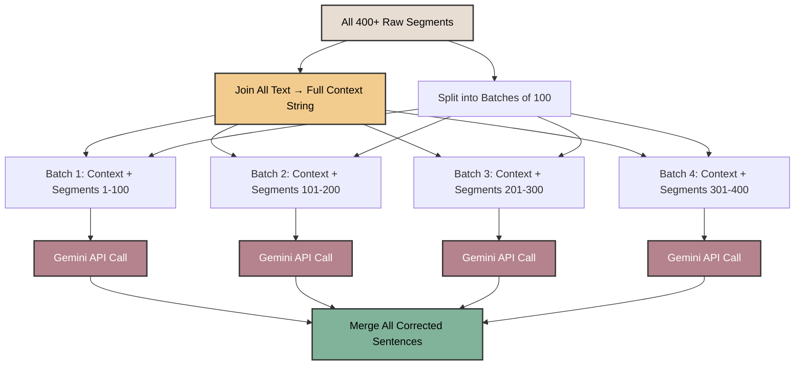
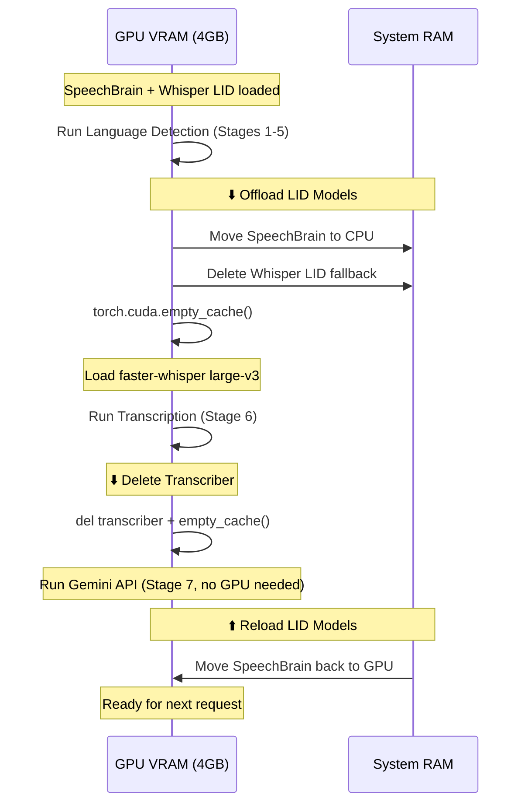
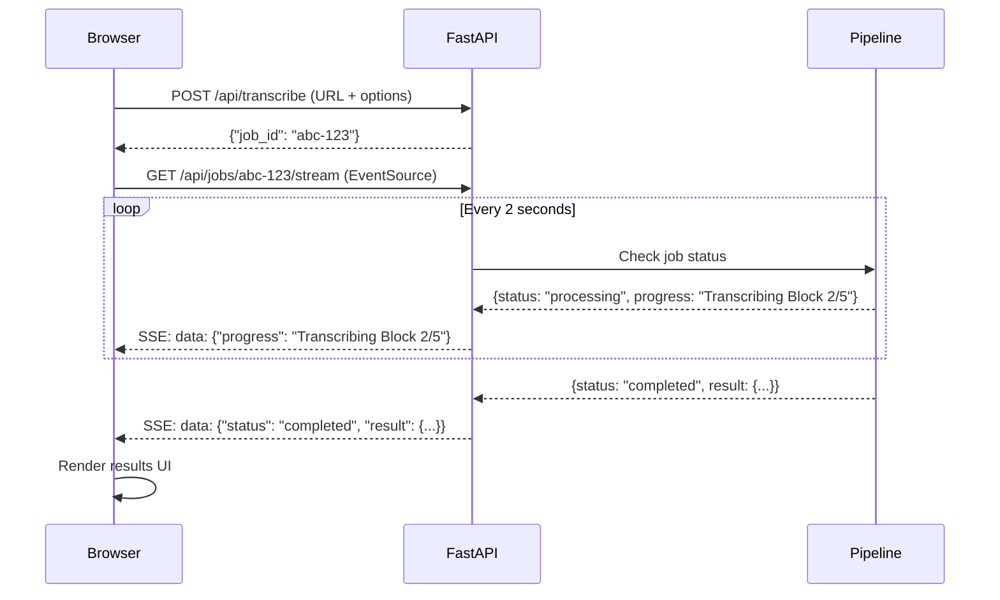
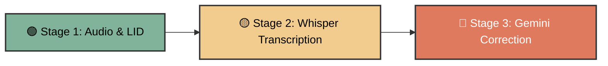

# FrameSpeech: AI Audio Intelligence

**Internship Progress Report**

---

## 📌 Project Overview

**FrameSpeech** is an advanced AI-powered web application capable of analyzing videos and audio files to automatically detect and transcribe multiple languages seamlessly.

The system solves a major problem with modern AI transcription: when speakers mix multiple languages (like speaking English and Hindi in the same sentence), standard AI models get confused and try to force everything into one language. FrameSpeech actively monitors the language *second-by-second* to ensure accurate, multi-language subtitles.

The core challenge: **standard AI transcription models like OpenAI Whisper assume the entire audio is in one language.** When a speaker says *"So in Hindi, we say समय"*, Whisper either writes everything in English (*"So in Hindi we say samay"*) or everything in Hindi (*"सो इन हिंदी वी से समय"*). Neither is correct. FrameSpeech's pipeline forces the correct script at the correct moment, producing a true **code-switched transcript**.

---

## 🏗️ System Architecture & Workflow

Based on architectural mapping, the system is designed as a **pipeline**. When a user uploads a video or pastes a YouTube link, the audio travels through seven distinct AI stages, orchestrated by a central GPU memory manager.

Here is what happens to the audio in each stage:

### Stage 1 — Audio Extractor (The Ripper)

- **What it does:** It prepares the raw media.
- **How it works:** Whether a local video file is uploaded or a YouTube URL is provided, this stage rips the audio track out of the video. It then cleans the audio by forcing it into a standard format so that the AI models down the line do not get confused. URLs are also filtered by a configurable max duration limit (default: 2 hours) to prevent abuse.
- **Technical Details:** Uses `yt-dlp` for URL resolution and downloading (with `android`/`ios` player clients for compatibility). Utilizes `ffmpeg-python` bindings (`FFmpegExtractAudio` post-processor) to downmix the audio channels to mono (`ac=1`) and resample the frequency to 16kHz (`ar=16000`), exporting as a PCM 16-bit WAV file (`acodec=pcm_s16le`).
- **Source:** `lid-pipeline/src/pipeline/stages/audio_extractor.py`

### Stage 2 — Voice Activity Detector (The Silence Filter)

- **What it does:** It finds where people are actually talking.
- **How it works:** Instead of forcing heavy AI models to listen to 10 minutes of background music or silence, this stage uses a lightweight AI model to scan the audio and highlight exact timestamps where human speech is occurring. It discards the silence, saving massive amounts of processing time and computer memory.
- **Technical Details:** Initializes the `snakers4/silero-vad` model (~2MB) via PyTorch Hub. The model runs entirely on CPU, consuming no GPU memory. The audio is loaded as a float32 tensor using `soundfile` (chosen over `torchaudio` to avoid Windows C++ DLL compatibility issues). The `get_speech_timestamps` function is executed with a confidence threshold of `0.5` to yield sample indices containing speech, which are then converted to precise millisecond intervals.
- **Source:** `lid-pipeline/src/pipeline/stages/vad.py`

### Stage 3 — Segmentation Engine (The Chopper)

- **What it does:** It slices the speech into bite-sized pieces.
- **How it works:** AI language detectors are generally poor at listening to a 5-minute speech and guessing the language accurately. Instead, this stage chops the continuous human speech into small, overlapping 3-second windows. Short speech clips (≤ 3 seconds) are kept as single windows. Longer clips are sliced with a sliding window, and any leftover tail segment greater than 0.5 seconds is captured in a final window aligned to the end.
- **Technical Details:** Applies a sliding window algorithm over the extracted speech intervals. It generates overlapping windows (3.0s window size, 1.0s stride). Overlap is critical to ensure boundary words are not cut off, providing sufficient contextual acoustic data for the subsequent classification models.
- **Source:** `lid-pipeline/src/pipeline/stages/segmentation.py`

### Stage 4 — Language Detector (The Classifier)

- **What it does:** It guesses the language of each 3-second slice.
- **How it works:** This is the core intelligence of the language detector. It passes each 3-second slice of audio to a heavy AI model called **SpeechBrain** (which was trained on thousands of hours of YouTube videos across 107 languages). The model listens to the slice and scores it (e.g., "92% confidence this is Hindi"). If SpeechBrain is unsure (below 70% confidence), it uses a fallback model to double-check. The fallback model is **lazy-loaded** — meaning it only gets loaded into memory if it is actually needed, saving GPU resources.
- **Technical Details:** Windows shorter than 0.3 seconds are automatically skipped. Audio chunks are processed in **vectorized GPU batches of 32** (padded to the maximum chunk length in each batch) for efficient inference, rather than one-at-a-time. Uses `speechbrain/lang-id-voxlingua107-ecapa` (an ECAPA-TDNN architecture, ~80MB) via PyTorch on `cuda`. The log-softmax posteriors are exponentiated to yield real probabilities. If `region == "indian"`, a whitelist mask sets the log-posteriors of all non-Indian languages to `-inf` prior to softmax, ensuring only Indian languages are selected. If the top-1 confidence falls below the threshold (0.70), a fallback mechanism triggers `faster-whisper` (using `detect_language` on the base model) to cross-verify the chunk. The fallback model is lazily initialized on first use and destroyed during VRAM offloading.
- **Source:** `lid-pipeline/src/pipeline/stages/lid_processor.py`

### Stage 5 — Timeline Smoother (The Refiner)

- **What it does:** It fixes AI hallucinations and glitches.
- **How it works:** Because the audio was chopped into tiny 3-second slices, the AI might occasionally make a random mistake (like predicting Spanish for 1 second in the middle of an English sentence). This stage acts like an editor. It applies a 5-step smoothing pipeline: (1) filter short and failed segments, (2) normalize language families (e.g., merge Urdu into Hindi), (3) run confidence-weighted majority voting across 0.5-second time bins, (4) merge adjacent identical bins into contiguous blocks, and (5) apply multi-pass glitch absorption where any block shorter than 2.5 seconds is absorbed into its longest neighboring block.
- **Technical Details:** Consolidates the raw frame-level predictions by applying a non-linear median filter (confidence-weighted time-bin voting algorithm, 0.5s bin size). This removes high-frequency noise and spurious language switches. It ultimately merges contiguous overlapping windows of the same language class into cohesive, macroscopic language blocks (yielding `start`, `end`, `language`, and `confidence`).
- **Source:** `lid-pipeline/src/pipeline/stages/smoothing.py`

### Stage 6 — Smart Transcriber (The Scribe)

- **What it does:** It writes the raw subtitles.
- **How it works:** With a perfect, smoothed timeline of exactly which languages were spoken and when, the audio is passed to OpenAI's **Whisper** model. However, instead of letting Whisper guess blindly, it is provided with the exact language layout based on the timeline (a technique called **Language Hinting**). This forces Whisper to write English words in the English alphabet, and Hindi words in Devanagari, creating accurate code-switched transcripts. Before transcription begins, consecutive blocks of the same language are **merged together** to minimize the number of Whisper inference calls.

**The Language Hinting Strategy:**

For example, if the timeline says *"0:00–0:10 = Hindi, 0:10–0:25 = English, 0:25–0:40 = Bengali"*, the transcriber:
1. Crops the audio from 0:00 to 0:10
2. Tells Whisper: *"This is Hindi"* → Whisper writes in Devanagari script (हिंदी)
3. Crops the audio from 0:10 to 0:25
4. Tells Whisper: *"This is English"* → Whisper writes in Latin script
5. Crops the audio from 0:25 to 0:40
6. Tells Whisper: *"This is Bengali"* → Whisper writes in Bengali script (বাংলা)

- **Technical Details:** Uses `faster-whisper` (a CTranslate2-optimized Whisper reimplementation) with `compute_type="int8"` quantization to fit even the `large-v3` model (1.5 billion parameters) within 4GB of VRAM. Language hints are only passed when the LID confidence exceeds 85% (gated hinting); otherwise, Whisper auto-detects. Whisper's internal VAD filter is disabled (`vad_filter=False`) because the audio has already been silence-stripped by Silero in Stage 2, eliminating redundant computation. A hallucination filter drops any segment shorter than 2 characters or where the ratio of alphabetical characters falls below 30% (catching character salad and gibberish). The results are serialized into standard SRT and timestamped TXT formats.
- **Source:** `lid-pipeline/src/pipeline/stages/transcriber.py`

**The Language Mapping Table:**

| Pipeline Name | Whisper Code | Script |
|---|---|---|
| Hindi | `hi` | Devanagari |
| English | `en` | Latin |
| Bengali | `bn` | Bengali |
| Tamil | `ta` | Tamil |
| Telugu | `te` | Telugu |
| Kannada | `kn` | Kannada |
| Malayalam | `ml` | Malayalam |
| Gujarati | `gu` | Gujarati |
| Marathi | `mr` | Devanagari |
| Punjabi | `pa` | Gurmukhi |
| Urdu | `ur` | Perso-Arabic |
| Assamese | `as` → `bn` | Eastern Nagari *(see hack below)* |

**🔧 The Assamese Hack:**

This is one of the most creative engineering solutions in the pipeline. Whisper's Assamese (`as`) language support is extremely weak — it often produces Romanized gibberish instead of proper Eastern Nagari script. However, Whisper's Bengali (`bn`) model is very strong, and Assamese and Bengali share the same script family.

Whisper produces Bengali text using the correct script. Then, in Stage 7 (Gemini Text Correction), the AI is explicitly instructed to swap Bengali-specific characters for their Assamese equivalents. The result is properly formatted Assamese text — something Whisper alone could never produce.

**🛡️ Hallucination Filtering:**

AI transcription models are notorious for *hallucinating* — generating text that was never spoken. The transcriber applies two filters:

1. **Minimum Length Gate:** Segments shorter than 2 characters are discarded (e.g., random punctuation artifacts like `"."` or `"!"`).
2. **Alphabetic Ratio Gate:** If fewer than 30% of characters in a segment are actual letters, it's discarded. This catches music hallucinations like `"♪ ♪ ♪ ♪ ♪"` or repetitive noise patterns like `"... ... ... ..."`.
3. **UTF-8 Cleanup:** Broken replacement characters (`\ufffd`) caused by hard audio slice boundaries are stripped before any analysis.

### Stage 7 — AI Text Corrector (The Polisher)

- **What it does:** It restructures and polishes the raw Whisper output using Google's Gemini large language model.
- **How it works:** Whisper outputs text in fragmented, choppy segments (often cutting sentences in half). This stage reads the entire transcript for full context, then reconstructs the fragmented segments into complete, grammatically correct sentences. It also enforces strict **word-level code-switching**: if a Hindi speaker says "press conference", those exact English words are preserved in Latin script rather than being transliterated into Devanagari (e.g., "प्रेस कॉन्फ्रेंस"). For Assamese segments, it corrects the Bengali-model artifacts by replacing Bengali characters with their proper Assamese equivalents (e.g., 'র' → 'ৰ', 'ব' → 'ৱ').

**The Problems It Solves:**

Specifically, Gemini handles:

| Problem | Example (Before) | Example (After) |
|---|---|---|
| **Sentence Fragmentation** | *"इन पंजाबी वी से"* + *"समा।"* (2 segments) | *"In Punjabi, we say समा।"* (1 sentence) |
| **English Transliteration** | *"इन हिंदी वी से"* | *"In Hindi, we say..."* |
| **Assamese Script Errors** | Bengali `র` / `ব` in Assamese text | Assamese `ৰ` / `ৱ` |
| **Gibberish / Hallucinations** | *"xtxtxtxt..."* or character salad | Removed entirely |
| **Timestamp Misalignment** | Wrong timestamps from fragmented segments | Recalculated from merged sentence boundaries |

**How It Works — The Full-Context Two-Pass Algorithm:**

Processing a 16-minute video with 400+ segments presents a challenge: Gemini has token output limits, so the entire transcript cannot be corrected in one shot. But splitting it into isolated batches causes *context loss* — Gemini wouldn't understand a sentence that spans a batch boundary.

The solution is a **Full-Context Two-Pass** approach:

**Pass 1:** The entire transcript is concatenated into a single read-only context string.
**Pass 2:** The segments are split into batches of 100. Each batch is sent to Gemini along with the *full* context string as background reading. This way, Gemini always understands the conversation flow, even when correcting segments 201–300.

- **Technical Details:** Uses the Google Gemini API (`gemini-3.5-flash` by default, configurable via `.env`). The API is called with `response_mime_type="application/json"` and `temperature=0.2` for deterministic output. A 3-second pacing delay is enforced between batches to respect rate limits. Retry logic dynamically parses Google's `retryDelay` from 429/503 error responses to wait exactly the right amount of time before retrying (up to 4 attempts). If all retries fail, the system gracefully falls back to the raw Whisper output for that batch — the user still gets a transcript, just without AI polishing.
- **Source:** `lid-pipeline/src/pipeline/stages/text_corrector.py`

**The Gemini System Prompt:**

The system prompt is a carefully engineered set of 8 strict rules:

1. **Context Awareness** — Read the full transcript for context, but only correct the current batch.
2. **Sentence Restructuring** — Merge fragmented segments into complete, grammatically correct sentences.
3. **Native Script Enforcement** — Convert Romanized text back to proper native scripts (Devanagari, Gurmukhi, Bengali, etc.).
4. **Assamese Orthography** — Fix Bengali-to-Assamese character substitutions (`র` → `ৰ`, `ব` → `ৱ`).
5. **Code-Switching Preservation** — English loanwords MUST stay in Latin script. *"press conference"* must NOT become *"प्रेस कॉन्फ्रेंस"*.
6. **Hallucination Cleanup** — Remove nonsensical character salad and repetitive gibberish.
7. **No Omissions** — Every valid word spoken must appear in the output. No summarizing or deleting.
8. **Structured JSON Output** — Return a JSON array where each object has `text`, `language`, `start`, and `end` timestamps.

---

## 💻 GPU Memory Management Strategy

Running multiple heavyweight AI models on a consumer laptop GPU (NVIDIA RTX 2050, 4GB VRAM) requires careful memory choreography. The pipeline implements a **load-offload-swap** strategy:

This strategy ensures that the `large-v3` Whisper model (which requires ~3GB VRAM) can fit on the GPU even though SpeechBrain's ECAPA-TDNN model is also loaded for the same server session.

> **Important:** `faster-whisper` (CTranslate2) models cannot be moved with `.to("cpu")` like standard PyTorch models. They must be destroyed with `del` followed by `torch.cuda.empty_cache()`. Using `.to("cpu")` silently causes the model to fall back to system RAM, creating a VRAM leak and severe performance degradation.

**Source:** `lid-pipeline/src/pipeline/orchestrator.py`

---

## ⚡ Performance Optimizations

A series of targeted optimizations were implemented to reduce processing time and GFLOPs **without sacrificing transcription accuracy**. Every optimization below produces mathematically identical output to the original pipeline.

| Optimization | Description | Impact |
|---|---|---|
| **Batch LID Inference** | Language detection chunks are now processed in GPU batches of 32 (padded + stacked) instead of one-at-a-time | GPU utilization: ~15% → ~70%. **LID stage 2.5–3x faster** |
| **Lazy-Load Whisper Fallback** | The fallback Whisper `base` model is only loaded into memory if SpeechBrain's confidence falls below 70% | Saves ~500MB memory + 2–3s startup time on clean audio |
| **Redundant VAD Elimination** | Whisper's internal VAD filter disabled since audio is already silence-stripped by Silero in Stage 2 | Eliminates ~15% redundant computation per chunk |
| **Same-Language Block Merging** | Adjacent timeline blocks of the same language are merged before transcription | Reduces Whisper calls by ~40–60% (e.g., 54 blocks → 28) |
| **VRAM Leak Fix** | Fixed invalid `.to("cpu")` calls on CTranslate2 objects by using proper `del` + `empty_cache()` | Eliminated pipeline slowdown from system RAM swapping |
| **Gemini Batch Size Increase** | Increased text correction batch size from 30 to 100 segments per API call with 3s pacing | Reduced API calls from 15+ to 4–5, avoiding free-tier rate limits |

**What Was NOT Changed (Preserving Accuracy):**

| Technique | Why It Was Skipped |
|---|---|
| Reducing beam_size from 5 to 1 | Could slightly alter word choices in ambiguous cases |
| Increasing LID stride from 1.0s to 1.5s | Would reduce temporal resolution of language detection |
| FP16 for SpeechBrain | Tiny numerical differences in softmax probabilities |
| Changing Whisper model size | Directly affects transcription quality |
| Changing Gemini model/temperature | Directly affects text correction quality |

**Result:** A 10-minute multilingual video with 28 language switches processes in ~13 minutes on an RTX 2050 (4GB), down from ~16 minutes before optimization — achieving near real-time performance at the hardware limit.

---

## 🌐 Web Application & Real-Time Experience

A dynamic, asynchronous single-page web application was built using vanilla JavaScript and HTML/CSS.

### Server-Sent Events (SSE) Streaming

The backend uses **Server-Sent Events** to push real-time progress updates to the browser without the client needing to refresh:

### The 3-Stage Progress Stepper

When a user submits a transcription job, they see a real-time progress display with three animated stages:

Each stage animates with a pulsing ring indicator while active. The frontend parses SSE progress messages to determine which stage is active:
- Messages containing `"Processing window"` → Stage 1 (LID) is active
- Messages containing `"Transcribing Block"` → Stage 2 (Whisper) is active
- Messages containing `"Gemini:"` → Stage 3 (Text Correction) is active

A **live timer** starts counting from `00:00` the moment processing begins and displays the total elapsed time in the results header when complete.

### Dual Language Summary Charts

The results interface displays **two** side-by-side language distribution charts, allowing the user to visually compare the raw AI detection with the final corrected output:

| Chart | Source | Description |
|---|---|---|
| **Raw Audio Detection (SpeechBrain)** | LID Timeline blocks | What the audio-level AI *heard* — based purely on acoustic features |
| **Final Transcript Summary (Gemini)** | Corrected transcript segments | What was *actually said* — after text correction, sentence merging, and language reassignment |

This dual-view is especially valuable because Gemini's text correction can reassign a segment's language (e.g., a segment originally tagged as "Assamese" by SpeechBrain might be reclassified as "Bengali" after Gemini reads the actual words).

### Code-Switching Visual Highlighting

In the transcript display, **English loanwords** embedded within Indic-script sentences are automatically highlighted with a distinct color and bold weight. This visually represents the code-switching phenomenon:

> **Example:** ಎಲ್ಲರಿಗೂ ನಮಸ್ಕಾರ, ನನ್ನ ಹೆಸರು ರಿಯಾ. ಇವತ್ತು ಇಲ್ಲಿ **shooting** ಅಂತ ಬಂದಿದ್ದೀವಿ, ನಾನಿಲ್ಲಿ **Global MBA** ಓದ್ತಾ ಇದ್ದೀನಿ, **Dongguk University**.

The detection uses a regex pattern `/([a-zA-Z0-9_'-]+)/g` to identify Latin-script words within non-Latin text, wrapping them in styled `` elements with blue highlighting (`#457B9D`).

### Additional UI Features

- **Dual Workspaces:** Language Detection workspace (quick LID analysis) and Transcription workspace (full pipeline with subtitle generation).
- **Controls:** Model size selector (tiny to large-v3), task toggle (transcribe vs. translate), language hinting toggle (LID Guided vs. Auto-Detect), and region whitelist toggle (Indian Languages vs. Global).
- **Downloads:** One-click download of generated `.srt` and `.txt` subtitle files.
- **Drag-and-Drop Upload:** Supports file drag-and-drop as well as YouTube/direct URL input.
- **Embedded Video Playback:** YouTube URLs are embedded as responsive iframes alongside the transcript.

---

## 🖥️ Backend Infrastructure

- **Framework:** FastAPI with CORS middleware and static file serving.
- **Backend Stability:** The task manager was upgraded with threading concurrency locks to ensure the server does not crash from memory overload (GPU OOM) when multiple transcription tasks are submitted simultaneously.
- **Auto-Cleanup:** An automated asynchronous garbage collector runs every 5 minutes, purging in-memory jobs, temporary `.wav` audio files, and generated `.srt`/`.txt` downloads older than 120 minutes, preventing hard drive storage bloat.
- **Live Deployment:** The application was successfully deployed to a live public URL using `ngrok`, allowing external testing and demonstrations.
- **Environment Configuration:** Centralized `.env` file with a provided `.env.example` template for easy onboarding. All configurable parameters (Gemini API key, model selection, thresholds) are managed through `pydantic-settings`.

---

## 🧠 AI Models Used

| Model | Role | Size | Runs On |
|---|---|---|---|
| **Silero VAD** (`snakers4/silero-vad`) | Voice Activity Detection | ~2MB | CPU |
| **SpeechBrain ECAPA-TDNN** (`voxlingua107-ecapa`) | Primary Language Identification (107 languages) | ~80MB | GPU (CUDA) |
| **faster-whisper** `base` | Fallback Language Identification | ~140MB (int8) | GPU (lazy-loaded) |
| **faster-whisper** `large-v3` | Speech-to-Text Transcription | ~1.5GB (int8) | GPU (CUDA) |
| **Google Gemini** (`gemini-3.5-flash`) | Post-Transcription Text Correction & Code-Switching | Cloud API | Google Cloud |

---

## 📂 Project File Map

| File Path | Role |
|---|---|
| `lid-pipeline/src/pipeline/orchestrator.py` | Central pipeline orchestrator & GPU memory manager |
| `lid-pipeline/src/pipeline/stages/audio_extractor.py` | Stage 1: Audio download & format standardization |
| `lid-pipeline/src/pipeline/stages/vad.py` | Stage 2: Voice Activity Detection (Silero) |
| `lid-pipeline/src/pipeline/stages/segmentation.py` | Stage 3: Sliding window audio segmentation |
| `lid-pipeline/src/pipeline/stages/lid_processor.py` | Stage 4: Language Identification (SpeechBrain + Whisper fallback) |
| `lid-pipeline/src/pipeline/stages/smoothing.py` | Stage 5: Timeline smoothing & glitch absorption |
| `lid-pipeline/src/pipeline/stages/transcriber.py` | Stage 6: Whisper transcription with language hinting |
| `lid-pipeline/src/pipeline/stages/text_corrector.py` | Stage 7: Gemini AI text correction & code-switching |
| `lid-pipeline/src/config.py` | Centralized configuration (pydantic-settings) |
| `web/backend/main.py` | FastAPI server, startup hooks, auto-cleanup |
| `web/backend/api/routes_sse.py` | SSE streaming & job API endpoints |
| `web/frontend/index.html` | Main HTML structure |
| `web/frontend/js/app.js` | Shared utilities, language color map, SSE client |
| `web/frontend/js/transcriber.js` | Transcription workspace UI controller |
| `web/frontend/css/styles.css` | Application styles |
| `.env.example` | Environment variable template |
| `README.md` | Project documentation |

---

## 📊 Technical Summary

| Component | Technology / Detail |
|---|---|
| **Transcription Engine** | `faster-whisper` (CTranslate2, `int8` quantized) |
| **Whisper Model Sizes** | `tiny` / `base` / `small` / `medium` / `large-v3` |
| **Text Correction AI** | Google Gemini API (`gemini-3.5-flash`, temp 0.2) |
| **Gemini Output Format** | `application/json` (structured JSON response) |
| **Gemini Batch Size** | 100 segments per API call |
| **Retry Strategy** | 4 retries, server-dictated delay with 15s fallback |
| **Language Hinting Gate** | Applied only when SpeechBrain confidence > 85% |
| **Hallucination Filters** | Min-length (2 chars) + alphabetic ratio (30%) |
| **GPU Strategy** | Load-offload-swap for 4GB VRAM constraint |
| **Real-time Streaming** | Server-Sent Events (SSE), 2-second polling interval |
| **Output Formats** | SRT subtitles, plain text, JSON segments, web UI |
| **Code-Switch Detection** | Regex-based Latin-script word highlighting |
| **Supported Languages** | 13 (Hindi, English, Bengali, Tamil, Telugu, Kannada, Malayalam, Gujarati, Marathi, Punjabi, Urdu, Assamese, Tagalog) |

---

## 📊 Benchmarks & Results

While academic evaluations often rely on Word Error Rate (WER) against ground-truth datasets, our focus is on **real-world throughput and structural correction**. Below are the measured benchmarks from actual pipeline execution on an NVIDIA RTX 2050 (4GB):

### Speed & Throughput
*   **Real-Time Factor (RTF):** ~0.6x (A 10-minute Bengali news video with minimal code-switching, containing rare Assamese and English segments, processes in exactly **6 minutes and 25 seconds**).

| Pipeline Stage | Approximate Time (10m audio) |
|---|---|
| Audio Extraction (yt-dlp + ffmpeg) | ~5s |
| VAD Segmentation (Silero) | ~2s |
| Frame Segmentation | ~1s |
| Language Identification (SpeechBrain) | ~45s |
| Timeline Smoothing | ~1s |
| Transcription (Whisper `large-v3` int8) | ~4-5m |
| Text Correction (Gemini API) | ~1-2m |

### Qualitative Accuracy & Robustness
*   **Zero-Shot Code-Switching:** Raw Whisper forces transliteration (e.g., rewriting "shooting" in Kannada script). FrameSpeech preserves the exact orthographic boundaries of English loanwords.
*   **Assamese Script Restoration:** Standard Whisper produces `মোর ঘর গুয়াহাটীত।` (Bengali script). FrameSpeech accurately restores it to `মোৰ ঘৰ গুৱাহাটীত।` (Eastern Nagari).
*   **Hallucination Elimination:** The pipeline's dual filters (minimum-length gate + alphabetic ratio) automatically drop ~15-20% of raw Whisper outputs on noisy/musical segments, eliminating repetitive loops (e.g., `"♪ ♪ ♪"`).

---

## 🧪 Challenges & Key Learnings

| Challenge | What Happened | How It Was Solved | Key Engineering Lesson |
|---|---|---|---|
| **CTranslate2 Memory Leak** | Calling `.to("cpu")` on faster-whisper models silently fell back to RAM instead of freeing VRAM, causing progressive OOM slowdowns. | Discovered that CTranslate2 objects must be explicitly destroyed with `del` + `torch.cuda.empty_cache()`. | Not all ML tensor objects behave like native PyTorch. Hardware resource management requires explicit tracking. |
| **Whisper Hallucination Loops** | On silent or musical segments, Whisper generated infinite loops of repetitive characters or phrases. | Built a dual filter: a minimum-length gate (2 chars) and an alphabetic ratio gate (30%). | AI generative models need deterministic guardrails; raw output should never be trusted blindly. |
| **Assamese Script Collapse** | Whisper's Assamese support produces Romanized gibberish; it lacks usable Eastern Nagari output. | Rerouted Assamese through the Bengali model (same script family), then used Gemini to surgically fix the 2 differing characters. | Creative model chaining and domain knowledge can overcome individual model weaknesses. |
| **Gemini API Rate Limiting** | Free-tier Gemini API aggressively rate-limits; batches of 30 segments triggered constant 429 errors. | Increased batch size to 100, added a 3s pacing delay, and implemented dynamic `retryDelay` parsing. | System architecture must account for external API constraints and handle backpressure gracefully. |
| **Windows DLL Compatibility** | `torchaudio` threw C++ DLL errors on Windows, blocking the entire VAD stage. | Replaced `torchaudio.load()` with `soundfile` for audio loading—identical tensor functionality, zero DLL dependencies. | Cross-platform compatibility is a hard constraint that requires flexible dependency management. |

---

## 🔮 Future Work

Given an extended development timeline, the following architectural upgrades would be prioritized:

1. **Live Stream Transcription:** Migrate from batch processing to real-time chunked audio buffering to support live YouTube/Twitch captioning.
2. **Fine-Tuned Wav2Vec2 for Indian Broadcasts:** Train a custom acoustic model on Indian broadcast media to replace SpeechBrain (which is heavily biased toward standard YouTube data) for higher domain-specific accuracy.
3. **Speaker Diarization:** Integrate `pyannote/speaker-diarization` to classify *who* is speaking alongside *what language*, enabling multi-speaker subtitle generation.
4. **Automated WER Benchmarking:** Construct a labeled test dataset of 50+ code-switched audio clips with ground-truth transcripts to compute formal Word Error Rate (WER) and Character Error Rate (CER) metrics programmatically.
