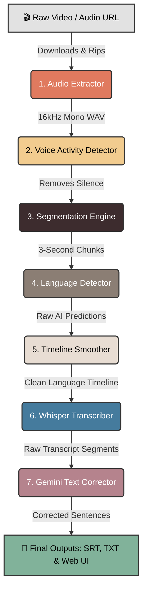
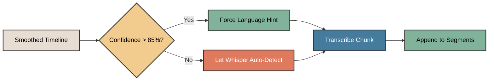
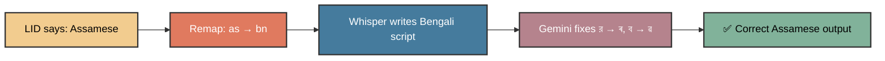
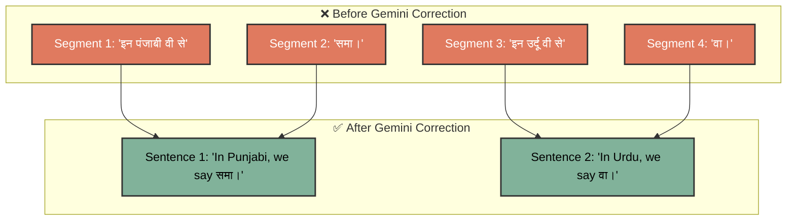
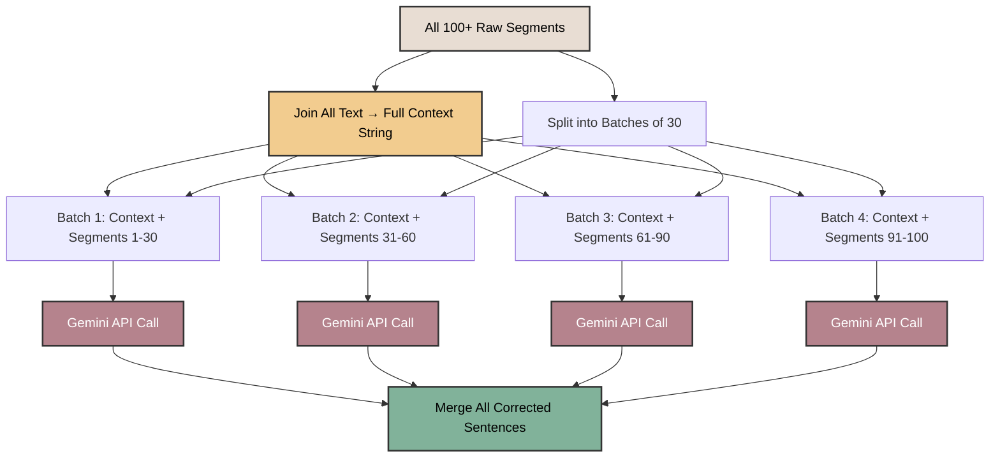
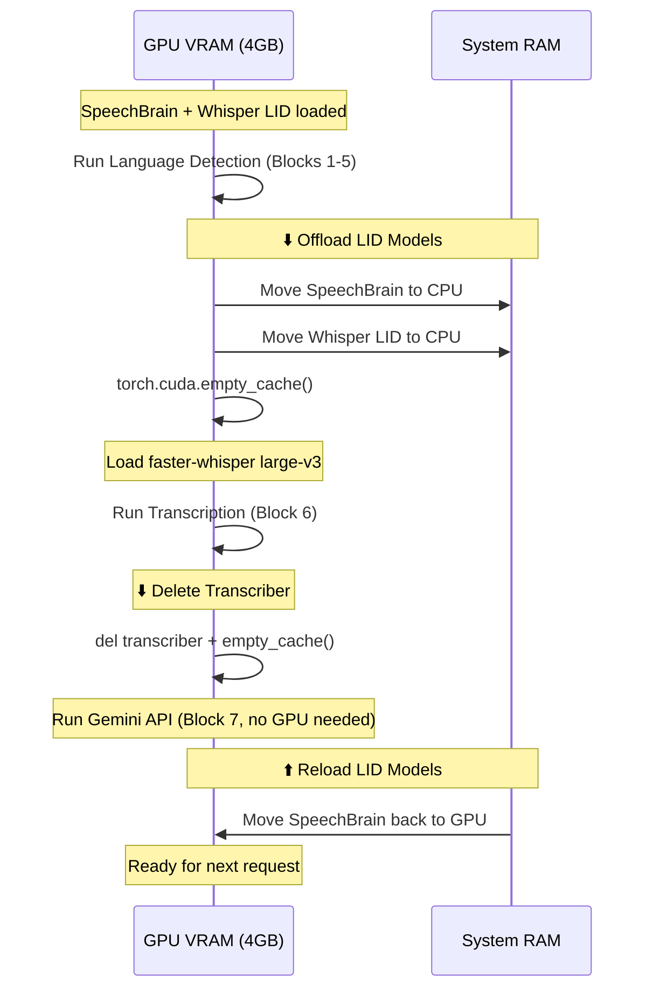
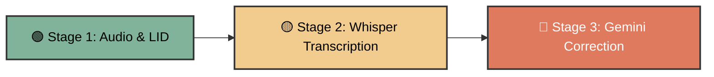
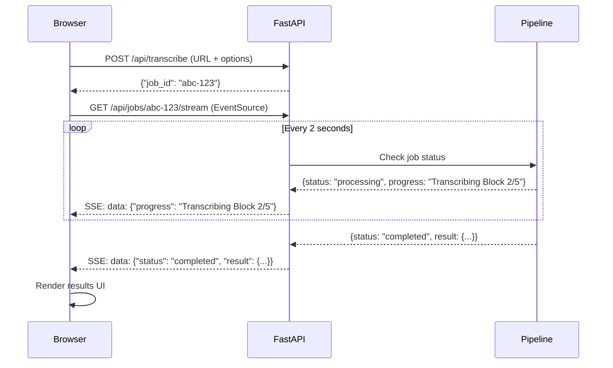

# FrameSpeech: AI Multilingual Transcription Engine
**Internship Progress Report — Model 3: Transcription & AI Text Correction**

---

## 📌 Project Overview

The **FrameSpeech Transcription Engine** is the third and most complex model in the FrameSpeech pipeline. While Models 1 and 2 answer the question *"What languages are being spoken?"*, Model 3 answers the harder question: *"What are they actually saying?"*

This model takes the clean, smoothed language timeline produced by the Language Detection pipeline and uses it to generate accurate, multi-script, code-switched subtitles — even when speakers freely mix Hindi, English, Bengali, Kannada, Tamil, Punjabi, and other languages in the same conversation.

The core challenge it solves: **standard AI transcription models like OpenAI Whisper assume the entire audio is in one language.** When a speaker says *"So in Hindi, we say समय"*, Whisper either writes everything in English (*"So in Hindi we say samay"*) or everything in Hindi (*"सो इन हिंदी वी से समय"*). Neither is correct. FrameSpeech's transcription engine forces the correct script at the correct moment, producing a true **code-switched transcript**.

---

## 🏗️ End-to-End System Architecture

The transcription pipeline extends the existing 6-block LID pipeline with two additional heavyweight AI stages — **Whisper Transcription** and **Gemini AI Text Correction** — bringing the total to 8 processing blocks.

> [!NOTE]
> Blocks 1–5 are shared with the Language Detection pipeline (covered in the Model 2 report). This report focuses exclusively on **Blocks 6–7** and the surrounding infrastructure.

---

## 🧠 Block 6: The Whisper Transcriber

### What It Does
This is the block that actually *listens* to the audio and converts speech into written text. It uses OpenAI's **faster-whisper** engine (a high-performance reimplementation of Whisper) to transcribe each language block separately, using the language timeline as a cheat sheet.

### How It Works — The Language Hinting Strategy

The key innovation is **Language Hinting**. Instead of letting Whisper blindly guess the language (which fails catastrophically on code-switched audio), the transcriber *tells* Whisper exactly which language to expect for each audio chunk:

For example, if the timeline says *"0:00–0:10 = Hindi, 0:10–0:25 = English, 0:25–0:40 = Bengali"*, the transcriber:
1. Crops the audio from 0:00 to 0:10
2. Tells Whisper: *"This is Hindi"* → Whisper writes in Devanagari script (हिंदी)
3. Crops the audio from 0:10 to 0:25
4. Tells Whisper: *"This is English"* → Whisper writes in Latin script
5. Crops the audio from 0:25 to 0:40
6. Tells Whisper: *"This is Bengali"* → Whisper writes in Bengali script (বাংলা)

**But there's a safety gate:** the hint is only applied when the language detector's confidence score exceeds **85%**. If SpeechBrain was unsure (e.g., only 60% confident it was Tamil), the system lets Whisper auto-detect instead of forcing a potentially wrong language.

### Technical Details
* **Engine:** `faster-whisper` (CTranslate2-based Whisper reimplementation) with `compute_type="int8"` for optimal GPU memory usage.
* **Supported Model Sizes:** `tiny`, `base`, `small`, `medium`, `large-v3`. The user selects this from the web UI dropdown.
* **Hot-Swap Capability:** The `switch_model()` method allows changing model sizes at runtime without restarting the server. It deletes the current model, clears the CUDA cache, and loads the new one.
* **Word-Level Timestamps:** Enabled via `word_timestamps=True`, producing start/end times for every individual word.
* **Built-in VAD Filter:** Whisper's internal VAD (`vad_filter=True`, `min_silence_duration_ms=500`) further reduces hallucinations on silent gaps within language blocks.

### The Language Mapping Table

The pipeline uses human-readable language names internally (e.g., *"Hindi"*, *"Bengali"*), but Whisper requires ISO 639-1 two-letter codes. This translation table bridges the gap:

| Pipeline Name | Whisper Code | Script |
|---|---|---|
| Hindi | `hi` | Devanagari |
| English | `en` | Latin |
| Bengali | `bn` | Bengali |
| Tamil | `ta` | Tamil |
| Telugu | `te` | Telugu |
| Kannada | `kn` | Kannada |
| Malayalam | `ml` | Malayalam |
| Gujarati | `gu` | Gujarati |
| Marathi | `mr` | Devanagari |
| Punjabi | `pa` | Gurmukhi |
| Urdu | `ur` | Perso-Arabic |
| Assamese | `as` → `bn` | Eastern Nagari *(see hack below)* |

### 🔧 The Assamese Hack

This is one of the most creative engineering solutions in the pipeline. Whisper's Assamese (`as`) language support is extremely weak — it often produces **Romanized gibberish** instead of proper Eastern Nagari script. However, Whisper's Bengali (`bn`) model is very strong, and Assamese and Bengali share the same script family (Eastern Nagari).

**The Hack:** When the timeline says "Assamese", the transcriber secretly tells Whisper it's Bengali:

Whisper produces Bengali text using the correct script. Then, in the next stage (Gemini Text Correction), the AI is explicitly instructed to swap Bengali-specific characters for their Assamese equivalents (e.g., Bengali `র` → Assamese `ৰ`, Bengali `ব` → Assamese `ৱ`). The result is properly formatted Assamese text — something Whisper alone could never produce.

### 🛡️ Hallucination Filtering

AI transcription models are notorious for *hallucinating* — generating text that was never actually spoken. This is especially common on noisy audio, music segments, or hard audio slice boundaries. The transcriber applies two filters before accepting any segment:

1. **Minimum Length Gate:** Segments shorter than 2 characters are discarded (e.g., random punctuation artifacts like `"."` or `"!"`).
2. **Alphabetic Ratio Gate:** If fewer than 30% of characters in a segment are actual letters, it's discarded. This catches music hallucinations like `"♪ ♪ ♪ ♪ ♪"` or repetitive noise patterns like `"... ... ... ..."`.
3. **UTF-8 Cleanup:** Broken replacement characters (`\ufffd`) caused by hard audio slice boundaries are stripped before any analysis.

---

## 🤖 Block 7: The Gemini AI Text Corrector

### What It Does
Even after language-hinted Whisper transcription, the raw output is far from perfect. Whisper fragments sentences across segment boundaries, sometimes transliterates English words into Indic scripts, and produces minor orthographic errors. The **Gemini Text Corrector** is a powerful post-processing layer that reads the *entire* transcript for context and rewrites it into clean, publication-ready sentences.

### The Problems It Solves

Specifically, Gemini handles:

| Problem | Example (Before) | Example (After) |
|---|---|---|
| **Sentence Fragmentation** | *"इन पंजाबी वी से"* + *"समा।"* (2 segments) | *"In Punjabi, we say समा।"* (1 sentence) |
| **English Transliteration** | *"इन हिंदी वी से"* | *"In Hindi, we say..."* |
| **Assamese Script Errors** | Bengali `র` / `ব` in Assamese text | Assamese `ৰ` / `ৱ` |
| **Gibberish / Hallucinations** | *"xtxtxtxt..."* or character salad | Removed entirely |
| **Timestamp Misalignment** | Wrong timestamps from fragmented segments | Recalculated from merged sentence boundaries |

### How It Works — The Full-Context Two-Pass Algorithm

Processing a 16-minute video with 100+ segments presents a challenge: Gemini has token output limits, so the entire transcript cannot be corrected in one shot. But splitting it into isolated batches causes *context loss* — Gemini wouldn't understand a sentence that spans a batch boundary.

The solution is a **Full-Context Two-Pass** approach:

**Pass 1:** The entire transcript is concatenated into a single read-only context string.  
**Pass 2:** The segments are split into batches of 30. Each batch is sent to Gemini along with the *full* context string as background reading. This way, Gemini always understands the conversation flow, even when correcting segments 61–90.

### The Gemini System Prompt

The system prompt is a carefully engineered set of 8 strict rules that govern Gemini's behavior:

1. **Context Awareness** — Read the full transcript for context, but only correct the current batch.
2. **Sentence Restructuring** — Merge fragmented segments into complete, grammatically correct sentences.
3. **Native Script Enforcement** — Convert Romanized text back to proper native scripts (Devanagari, Gurmukhi, Bengali, etc.).
4. **Assamese Orthography** — Fix Bengali-to-Assamese character substitutions (`র` → `ৰ`, `ব` → `ৱ`).
5. **Code-Switching Preservation** — English loanwords MUST stay in Latin script. *"press conference"* must NOT become *"प्रेस कॉन्फ्रेंस"*.
6. **Hallucination Cleanup** — Remove nonsensical character salad and repetitive gibberish.
7. **No Omissions** — Every valid word spoken must appear in the output. No summarizing or deleting.
8. **Structured JSON Output** — Return a JSON array where each object has `text`, `language`, `start`, and `end` timestamps.

### 🔄 Retry Logic with Exponential Backoff

The Gemini API can occasionally return `503 UNAVAILABLE` during traffic spikes. The corrector handles this gracefully:

| Attempt | Delay | Total Wait |
|---|---|---|
| 1st retry | 2 seconds | 2s |
| 2nd retry | 4 seconds | 6s |
| 3rd retry | 8 seconds | 14s |
| 4th retry | 16 seconds | 30s |
| **Fallback** | — | Returns uncorrected segments |

The formula is: $\text{delay} = 2 \times 2^{\text{attempt}}$ (exponential backoff).

If all 4 retries fail, the system gracefully falls back to the raw Whisper output for that batch — the user still gets a transcript, just without AI polishing.

---

## 💻 GPU Memory Management Strategy

Running multiple heavyweight AI models on a consumer laptop GPU (NVIDIA RTX 2050, 4GB VRAM) requires careful memory choreography. The pipeline implements a **load-offload-swap** strategy:

This strategy ensures that the `large-v3` Whisper model (which requires ~3GB VRAM) can fit on the GPU even though SpeechBrain's ECAPA-TDNN model is also loaded for the same server session.

---

## 🌐 Web Interface & Real-Time Experience

### The 3-Stage Progress Stepper

When a user submits a transcription job, they see a real-time progress display with three stages:

Each stage animates with a **pulsing ring** indicator while active. The frontend parses SSE progress messages to determine which stage is active:
- Messages containing `"Processing window"` → Stage 1 (LID) is active
- Messages containing `"Transcribing Block"` → Stage 2 (Whisper) is active
- Messages containing `"Gemini:"` → Stage 3 (Text Correction) is active

A **live timer** starts counting from `00:00` the moment processing begins and displays the total elapsed time in the results header when complete.

### Server-Sent Events (SSE) Streaming

The backend uses **Server-Sent Events** to push real-time progress updates to the browser without the client needing to refresh:

### Dual Language Summary Charts

The results interface displays **two** side-by-side language distribution charts, allowing the user to visually compare the raw AI detection with the final corrected output:

| Chart | Source | Description |
|---|---|---|
| **Raw Audio Detection (SpeechBrain)** | LID Timeline blocks | What the audio-level AI *heard* — based purely on acoustic features |
| **Final Transcript Summary (Gemini)** | Corrected transcript segments | What was *actually said* — after text correction, sentence merging, and language reassignment |

This dual-view is especially valuable because Gemini's text correction can reassign a segment's language (e.g., a segment originally tagged as "Assamese" by SpeechBrain might be reclassified as "Bengali" or "English" after Gemini reads the actual words).

### Code-Switching Visual Highlighting

In the transcript display, **English loanwords** embedded within Indic-script sentences are automatically highlighted with a distinct color and bold weight. This visually represents the code-switching phenomenon:

> **Example:** ಎಲ್ಲರಿಗೂ ನಮಸ್ಕಾರ, ನನ್ನ ಹೆಸರು ರಿಯಾ. ಇವತ್ತು ಇಲ್ಲಿ shooting ಅಂತ ಬಂದಿದ್ದೀವಿ, ನಾನಿಲ್ಲಿ Global MBA ಓದ್ತಾ ಇದ್ದೀನಿ, Dongguk University.

The detection uses a regex pattern `/([a-zA-Z0-9_'-]+)/g` to identify Latin-script words within non-Latin text, wrapping them in styled `` elements.

---

## 📊 Technical Summary

| Component | Technology / Detail |
|---|---|
| **Transcription Engine** | `faster-whisper` (CTranslate2, `int8` quantized) |
| **Whisper Model Sizes** | `tiny` / `base` / `small` / `medium` / `large-v3` |
| **Text Correction AI** | Google Gemini API (`gemini-3.5-flash`, temp 0.2) |
| **Gemini Output Format** | `application/json` (structured JSON response) |
| **Batch Size** | 30 segments per Gemini API call |
| **Retry Strategy** | 4 retries, exponential backoff ($2 \cdot 2^n$ seconds) |
| **Language Hinting Gate** | Applied only when SpeechBrain confidence > 85% |
| **Hallucination Filters** | Min-length (2 chars) + alphabetic ratio (30%) |
| **GPU Strategy** | Load-offload-swap for 4GB VRAM constraint |
| **Real-time Streaming** | Server-Sent Events (SSE), 2-second polling interval |
| **Output Formats** | SRT subtitles, plain text, JSON segments, web UI |
| **Code-Switch Detection** | Regex-based Latin-script word highlighting |
| **Supported Languages** | 13 (Hindi, English, Bengali, Tamil, Telugu, Kannada, Malayalam, Gujarati, Marathi, Punjabi, Urdu, Assamese, Tagalog) |

---

## 🚀 Current Status & Achievements

- **Full Pipeline Integration:** The transcription engine is fully integrated with the LID pipeline, sharing the same server process, GPU resources, and web interface.
- **Large-v3 on Consumer Hardware:** Through careful GPU memory choreography, the `large-v3` Whisper model (the highest quality) runs successfully on an NVIDIA RTX 2050 with only 4GB VRAM.
- **Gemini AI Post-Processing:** A sophisticated 8-rule system prompt with full-context batching produces publication-quality corrected transcripts with proper native scripts and preserved English code-switching.
- **Assamese Script Recovery:** The creative Bengali-proxy hack combined with Gemini orthographic correction produces accurate Assamese transcripts — something no single AI model can achieve alone.
- **Resilient API Handling:** Exponential backoff retry logic ensures the pipeline survives temporary Gemini API outages without losing the entire transcription.
- **Dual Summary Analytics:** Users can visually compare what the audio-level AI detected vs. what the text-level AI determined, providing transparency into the pipeline's decision-making.
- **Real-Time Progress Tracking:** A 3-stage animated stepper with live timer gives users clear visibility into the pipeline's progress via SSE streaming.
- **Web Interface:** Drag-and-drop file uploads, YouTube URL support, model size selection, region selection, language hinting toggles, downloadable SRT/TXT files, embedded video playback, and code-switching-highlighted transcripts — all in a polished, responsive web UI.
